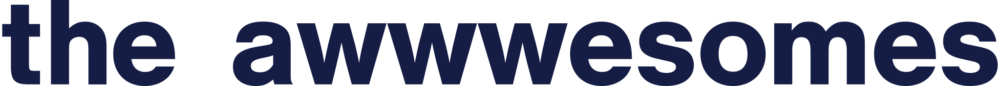

# Wstęp

> #### Info::Ważna informacja
>
> Niniejsza praca jest licencjonowana zgodnie z [Creative Commons Attribution-ShareAlike License 4.0 International](https://creativecommons.org/licenses/by-sa/4.0/).
> Jeśli zamierzasz skopiować fragmenty tutoriala i umieścić je w swojej pracy, będzie nam bardzo miło, kiedy nas o tym [poinformujesz](mailto:contact@theawwwesomes.org). Koniecznie umieść też informację o naszym autorstwie!

Cześć! To jest tutorial napisany przez [The Awwwesomes](http://theawwwesomes.org).
Wygląda na to, że przywędrowaliście tu, bo jesteście zainteresowani tworzeniem stron internetowych. Trafiliście zatem w bardzo dobre miejsce! Tworzenie stron jest naszą pasją i chcielibyśmy podzielić się nią z jak największą liczbą osób.

Będzie nam super miło, jeśli korzystając z tutoriala oznaczysz nas w mediach społecznościowych – np. na instagramie: [@theawwwesomes](http://instagram.com/theawwwesomes), lub na [facebook'u](https://www.facebook.com/theawwwesomes/) oraz dodasz hashtag: *#theawwwesomes*. Dzięki temu więcej osób dowie się o naszym tutorialu. Będzie to dla nas jak laurka, która dodaje skrzydeł :D
Tutorial jest całkowicie bezpłatny, bo wierzymy w ideę #SharingIsCaring i Open Source. Jeśli masz znajomych, którzy zmagają się z zakodowniem swojej strony, to koniecznie podziel się z nimi tym linkiem.

Po zakończeniu tutoriala, jeśli tylko będziesz mieć ochotę, zapraszamy do wystawienia oceny na [facebook'u](https://www.facebook.com/theawwwesomes/). Każdy feedback jest dla nas bardzo cenny! :)

## Dla kogo jest ten tutorial?

Tutorial powstał specjalnie z myślą o uczestnikach warsztatów [The Awwwesomes](http://theawwwesomes.org), ale przekonałyśmy się, że możemy podzielić się naszą wiedzą również online. Naszym celem było napisanie go w taki sposób, by był jak najbardziej przejrzysty i zrozumiały dla wszystkich, którzy będą korzystać z niego bez pomocy mentorów. Żeby uczyć się z tutoriala, nie potrzebujecie żadnej zaawansowanej wiedzy technicznej oprócz podstaw obsługi komputera (w tym umiejętności korzystania z przeglądarki WWW).

Dokładamy wszelkich starań, aby nasz tutorial był zrozumiały dla wszystkich, którzy nie mieli jeszcze *żadnej* styczności z budowaniem stron internetowych. Jeżeli jednak macie problemy z jakimkolwiek zagadnieniem, coś wydaje się niezrozumiałe, piszcie koniecznie na [contact@theawwwesomes.org](contact@theawwwesomes.org) lub śmiało pytajcie mentorów, jeśli uczestniczycie w warsztatach.

Z drugiej strony, dla osób, które mają już pewne doświadczenia z programowaniem niektóre fragmenty mogą wydawać się proste i jasne. Prosimy tu o wyrozumiałość - w takim przypadku pewnie możecie pominąć łatwą dla Was część tutoriala.

## Czego będziemy uczyć?

Zakres naszego kursu obejmuje dwa główne języki kodowania WWW, czyli **HTML** i **CSS**. Zdecydowaliśmy się nie włączać języka JavaScript ze względu na ograniczenia czasowe &ndash; JS jest zatem tematem na zupełnie osobny tutorial!

Ale nie przejmujcie się! Podczas warsztatów, na podstawie przykładowego layoutu nauczycie się, jak stworzyć od podstaw prostą, statyczną stronę internetową. Będziemy starali się od początku zakorzeniać w Was dobre praktyki w pisaniu kodu. Kodowanie HTML i CSS może wydawać się na początku niezbyt trudne. Jednak właśnie utrzymanie kodu w czasie stanowi w ich przypadku spore wyzwanie!

Zaczniemy od prostych przykładów w czystym HTML, który służy do definiowania zawartości strony. Potem zaczniemy się zagłębiać w tajniki CSS, czyli arkuszy stylów, które umożliwiają nam dopasowanie wyglądu strony do naszych potrzeb. Od początku będziemy też zachęcać Was do korzystania z profesjonalnych narzędzi programistycznych. Jak tylko poznacie podstawy (a nie będziemy z tym zwlekać), zabierzemy się do kodowania przykładowego layoutu.

A teraz &ndash; ruszamy w #awwwesome drogę!
